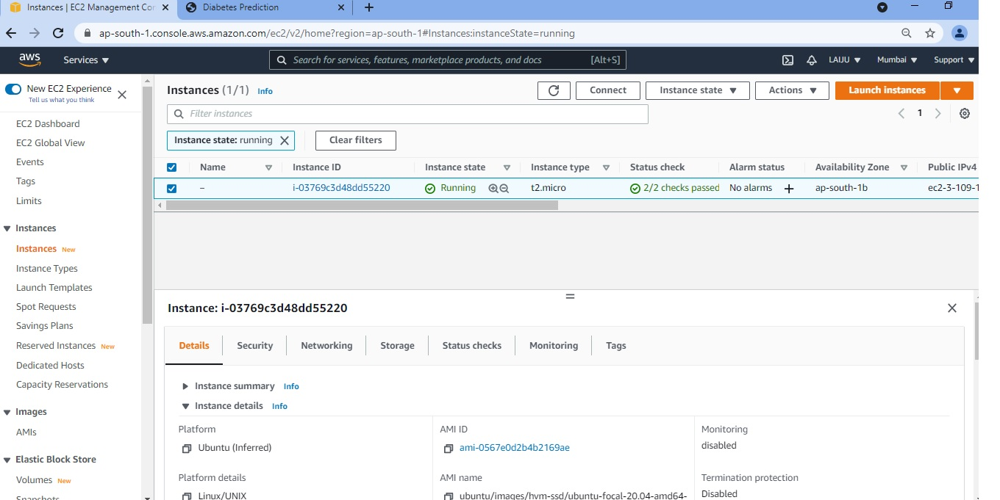
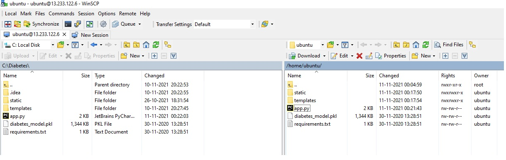
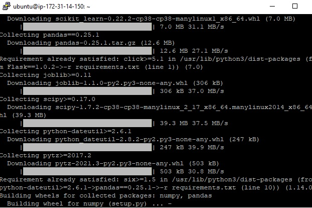
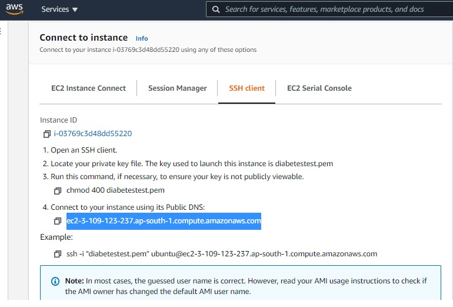
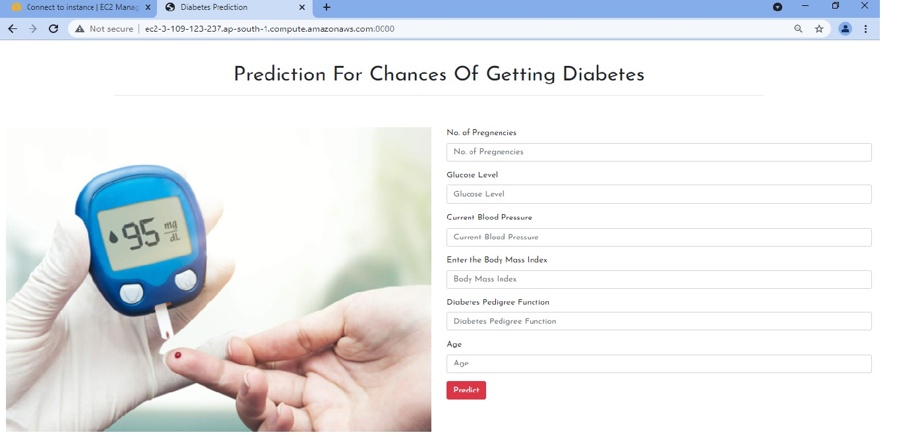

# BUILDING AN INTELLIGENT DIABETES PREDICTION SYSTEM 

It can perform prediction of diabetes based on required features mentioned on web application.

  
## Installation Screenshots

- AWS EC2 instance launch

- Copy files from local system to instance created

- Install required libraries in instance

- Connect instance using its public DNS

- Web App working on AWS EC2 instance

  
## Deployment

Deployed this project to AWS EC2 instance

  
## Tech Stack

**Prpgramming Language:** Python

**Libraries:** Tensorflow,Numpy,Scikit-Learn,Pandas

**API:** Flask

**Frontend Frameworks:** HTML,CSS

**Web Server:** AWS EC2 instance

**IDE:** Pycharm 

  
  
